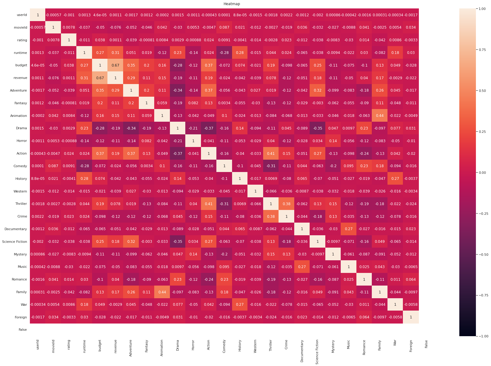
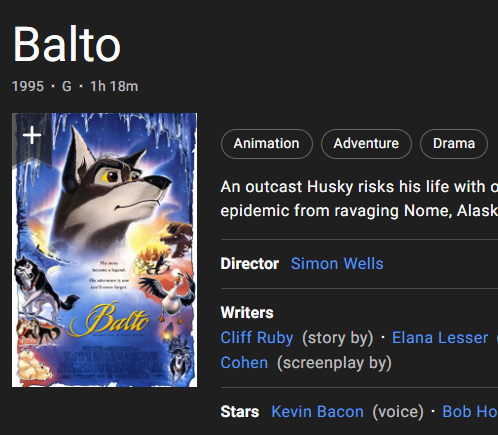
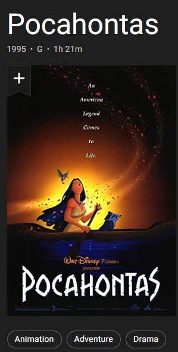
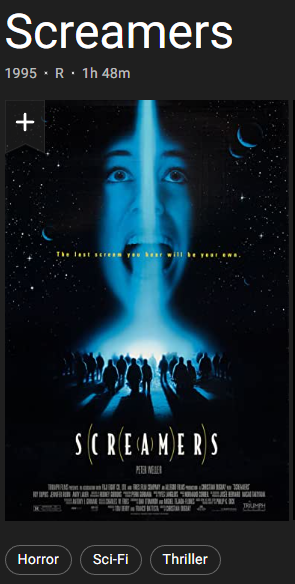
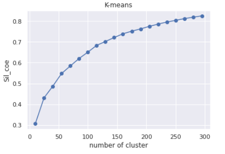
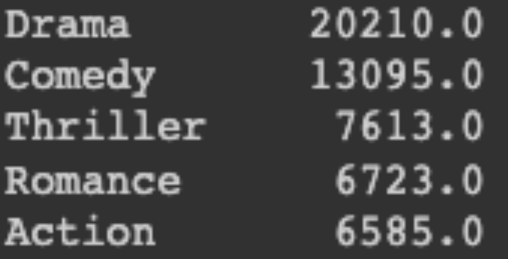

# CS7641-Midterm Report
Proposal for CS7641 project
____________________________________________________________________________________________________________________________________
# Dataset: 
[1] https://www.kaggle.com/datasets/ebiswas/imdb-review-dataset?select=sample.json

[2] https://www.kaggle.com/datasets/darshan1504/imdb-movie-reviews-2021
____________________________________________________________________________________________________________________________________
# Introduction/Background:
Unlike the traditional commercial model that consumers find what they want in stores, today's commercial website will help users discover new products and services via using a recommendation system. It not only benefits websites from selling their products but also prevents consumers from being overwhelmed by too many options of products. Schafer, J.B., Konstan, J.A., & Riedl, J. (2004) analyzed 6 websites that led the 2004 market: 1. Amazon.com, CDNOW, Drugstore.com, eBay, MovieFinder.com, and Reel.com. Even though they target different industries, their recommendation system relies on information from both items or users, particularly on consumers' ratings of products or services. Roy, D., Dutta, M. (2022) categorized recommender systems into three different types: 1. content-based recommender systems, 2. collaborative recommender systems, and 3. hybrid recommender systems. In a collaborative recommender system, this system applies users' features. The collaborative recommender system work based on the users' similarity. The hybrid recommender system integrates more than two techniques to mitigate the weakness of each separate recommender technique. As Jayalakshmi S, Ganesh N, Čep R, Senthil Murugan J. (2022) mentioned, an excellent film recommendation system will make recommendations for films that most closely match the similarities. We gathered two datasets for the project: one has user ratings of movies, and another has detailed information about films. They share the same film name so we will merge them in the future.

# Problem Definition:
This project aims to predict and recommend what films the user prefers via building a Films Recommendation System. With the prevalence of online services, more and more people can review and rating films, so a significant amount of information about films is created. Audiences have to spend more time searching for film information to decide if they want to watch the film. This project is vital to work on because it saves consumers time searching for information about films or other services. If film companies, like Netflix, can accurately recommend what users like, they benefit from the system by expanding the customer market and harnessing their purchasing power.

## Data Collection:
Currently, we have two kinds of datasets: 1). one consisting of user comments and their rating of different movies, 2). another has details about each movie that includes genre, run time, published years and, actors, Etc. Since we are focusing on clustering, which is unsupervised learning first, so we mainly utilize the second dataset and try to find similarities between movies. We removed data points that do not contain genre since it is the main difference between movies. We expanded the variable 'genre' into 32 dummy variables, 1 indicating the movie contains this genre. On dataset one, we plan to combine it to data set 2 based on the file's name, so details about the film will still be the features, and user rating will be the y to guide our model. For dataset one with user information, we isolated different users and planning do a model for everyone, but this requires one user to rate many movies. However, most of the time, one user only comments on a few movies, so we then want to utilize a sparse matrix format and handcrafted features for a more general model after. 

From the histogram, we observe that most of the rating concentrate between 3.0 to 4.0 on average. This means that most users tend to rate films relatively tolerant since they rarely give films extremely low scores. Of course, an extremely high score only appears occasionally.

# Methods, Matrixes and Potential Results Discussion
## Supervised Method:
1. Regression
2. Tree-based method
##  Update Method we already tried
1. Linear Regression
2. Decision Tree
3. MLP
4. SVD
5. KNN

### Metrics for Supervised Methods:
We choose several metrics to evaluate models’ performance. First, we will compute the model rmse for most methods we plan to implement; we will also construct the confusion matrix and then calculate precision and recall rate as well as graphing of ROC AUC. Secondly, we will use some additional matrix to assist to evaluate models, such as the F-beta score

### Potential Results Discussion for Supervised Methods:
Our group expect models with higher recall rate (0.7) because False negative indicates that the recommendation system does not predict what clients like to watch. If the model achieves higher recall rate, we can accept relatively lower precision rate (0.6). Secondly, we expect a ROC graph’s angle to be close to the right angle so that the AUC is greater than 0.7. F1 score takes into account of both false positive and false negative.

### Results Discussion for Supervised Methods:

### Results Discussion for Linear Regression:
We use the linear regression method to do exploratory data analysis. In our case, the responding variable is the users' rating only. The predicting variables are revenue, budget, and genres. Genre is a categorical variable, so we transformed it into dummy variables. We use LinearRegression() in sklearn to train the model and fit it. We get the following result: 1). MSE 1.10; 2). RMSE: 1.05 3). R-Square: 0.01. This R-square indicates only 1% of the variation of a dependent variable is explained by the predicting variables in the regression model. Such value is very low, which may be caused by unbalanced dataset. 

We build a correlation matrix to visualize each features association to predict variables. Top 10 features are: 'Animation', 'Action', 'Crime', 'War', 'Romance', 'Comedy', 'budget', 'revenue', 'Horror', and 'Drama'. Within the variables we used, we think that users prefer 'Animation', 'Action', 'Crime', 'War', 'Romance', and 'Comedy' films, which is in line with our expectations since they are the most well-known and common film types.

### Results Discussion for Naive Bayes:
Naive Bayes is an appropriate application along with collaborative filtering to build recommendation systems to predict whether the users would give good ratings on certain movies or not. Naive Bayes is an eager learning classifier and can be generative. It has fast learning speed and easy-to-predict ratings based on user data sets. Some limitations of Naive Bayes include the assumptions of independent predictors. If this assumption does not hold, the Naive Bayes can perform a bad estimation. This method performs better in the case of having categorical variables than numerical variables. Moreover, for numerical variables, the normal distribution is strongly assumed. To test the collinearity of our input data set, 
We calculated the VIF to check:

Variance inflation factors for those three variables are all relatively small. Therefore, no multicollinearity exists for features, and NB can be applied to our data set. 

Knowing my input data set includes categorical and continuous variables, we run Gaussian Naive Bayes because we have continuous variables associated with features like budget, revenue, or duration that affect the movie ratings. I added the Bernoulli NB since there are many binary/discrete variables in the input data set. We compared the Bernoulli NB model performance on the test data set with the Gaussian NB.

After running one Gaussian Naive Bayes model for each user, who leaves 50 ratings or more on different movies, we compute the RMSEs and accuracy scores and take the average of the total values of the model metrics from all the users. Our finding is that the Bernoulli NB model performs better in movie rating prediction considering the rating history of all the long-term users.

The result of the Bernoulli NB model performance: Accuracy: 0.401499, RMSE:  1.141724

The result of the Gaussian NB model performance: Accuracy: 0.182912, RMSE: 1.795371

### Results Discussion for for SVD and KNN:
We implement multiple variations of the matrix factorization-based algorithms, or SVD, to compare their performance on the same dataset. In order to reduce runtime and avoid kernel crashes, we use rating_small.csv rather than the whole rating.csv, which contains more than 27000000 ratings. The movie ratings are scaled from 1 to 5. The first algorithm is a simple SVD recommender adopted from HW3 Bonus. It mainly uses the singular value decomposition to factorize a user-movie rating matrix and then estimate the ratings of unrated movies, while the missing ratings in original data are filled with mean ratings of that specific movie to ensure SVD converges. There is only one hyperparameter to optimize: the number of latent factors k. Below is a sample prediction of the top 10 movies for a user with id 100 and k is 10:

It is cleared that simply filling in mean ratings produces unrealistic estimation due to a large amount of sparse data (little ratings available, so small mean values). By tuning k, we can see that RMSE is minimized at k = 15:

Since the RMSE is quite high and there are not many things we can do to improve the model performance, we decided to move to a more sophisticated SVD implementation. 

We then apply the Surprise package, which provides several built-in recommendation models and useful tools for validation. The second algorithm is the famous SVD popularized by Simon Funk during the Netflix Prize. Instead of direct singular value decomposition, this SVD uses a normal distribution to randomly initialize two matrices: the user-factor and the factor-movie matrices. In addition, stochastic gradient descent is implemented to optimize these matrices with regularization. To tune hyperparameters, We use grid-search cross-validation to go through all combinations of n_factors, n_epoch, lr_all, etc., on a train set. Although, given the size of the dataset and the long computing time for cross-validation, we are not able to try more exhaustive combinations. The best (lowest) RMSE and the corresponding parameter set on a is shown below: 

This set of parameters generates slightly better results than the simple SVD. Let us see how it does on the test set:

With a 10-fold cv, this best_svd produces a mean RMSE of 0.9428, which is still better than the performance of simple SVD on the train set (we did not split the data when training the simple SVD).

The third algorithm is an extension of SVD - SVD++, which considers implicit ratings. An implicit rating here refers to the fact that a user rated a movie, regardless of the actual rating. SVD++ works the same as the last SVD and has the same parameters. Similarly, we use the grid-search approach and cv on the test set. The results are demonstrated below:

The third algorithm is KNNBaseline, a KNN-based model including baseline ratings. The main hyperparameters are the max number of neighbor k, similarity measure, and baseline estimates. The same procedure of grid-search and cv on test is applied here as well:

In terms of training RMSE, we can see that SVD++ is the best, then SVD, KNNBaseline, and simple SVD follow. While SVD++ does not significantly outperform SVD on the test set -- with only a 0.0022 difference, KNNBaseline has a much higher RMSEon test that it actually underperforms SVD when generalizing to out-of-sample data. After such comparison, we implement several functions to see what the actual predictions of a specific user look like.

We use the respective best parameter sets for SVD, SVD++, and KNNBaseline to create a prediction on a user with id 75. Movies are ranked based on estimated ratings. The top 10 movies for user 75 recommended by SVD are shown below:

The top 10 movies for user 75 recommended by SVD++:

The top 10 movies for user 75 recommended by KNNBaseline:

The recommendations of the three models are similar. Galaxy Quest appears in all three recommendations, and Pandora's Box, The Thomas Crown Affair, and The Sixth Sense are in two recommendations. Moreover, most of these movies are sci-fi and thrill movies, clearly indicating the preference and tastes of users 75. Nevertheless, We want to provide not just a broad top n recommendation but rather a specific category the users may be interested in. Our effort of clustering movies with unsupervised methods could be useful here. We select hierarchical clustering and set n_neighbor = 10, n_clusters = 175, and linkage = "ward". This parameter set generates the highest silhouette score from the previous analysis. Next, the average ratings for each cluster are calculated, and the cluster with the highest average rating will be our recommendation. The cluster recommendation results are demonstrated below:

SVD

SVD++

KNNBaseline

### Results Discussion for user specific MLP, decition tree, Naive bayes:

During the implementation of supervised learning with MLP, decision tree, and naïve bayas, there are a lot of results worth discussing. In my previous opinion, that result with higher RMSE will result in lower accuracy. This is true for the most part. However, since our movie recommendation system predicts the score viewers will give to the movie, the accuracy can not fully represent the result. So, my idea is to mark a rating of 7 or higher as the liked movie and 6 or lower as a dislike. Then do the same thing for a result. It turns out that even MLP with sgd as the solution has a higher RMSE but comparing predict the result and actual label. The accuracy is higher for MLP with sgd. Followed by it are Gaussian Naïve bayas and decision tree classification. Decision tree regressor has the lowest RMSE but give a slightly worse result of 64.4% accuracy. MLP with sgd and fine-tuned hyperparameters can return an accuracy as high as 67.54%. To guess the reason behind it, I would say it is because when predicting, MLP guesses the higher score very high and lower answer very lower, thus leading to this result. 

Something worth noticing is that when running supervised tests on different users, the accuracy of all methods varies. For example, user one would have higher accuracy on all methods than user two. 

We have two suspensions. One is that different users have different rating habit, maybe one user likes to give higher ratings and only give a rating to the movie that he likes, then this user would be easy to predict. Another user might like to give ratings to all movies he watches, and give all movies ratings around six and seven, then his taste is hard to guess. I suggest preprocessing the ratings for each user before feeding them into any classifier, like the method I used for MLP, labeling all movies with seven or higher as positive, else negative. The preprocessing step changed the result dramatically. A personalized data transformer would be necessary for a more accurate result. Another reason would be that our data is limited. In our features, we have movie genres, run time, and gross income, but we lack features such as actor, director, and, most importantly, overall score on the website, such as IMDb rating or rotten tomato rating. I think these would be great features to make a better result, but unlucky, such a suitable dataset does not exist. During the project, our group feels the data processing step is equally, if not more important than the training part. This includes both data collection and processing in two steps. They decide how the model will learn and develop.

## Unsupervised Methods:
1. Hierarchical Clustering Algorithm
2. Principle Component Analysis
3. Collaborative filtering
4. DBSCAN

## Update Method that we already tried:
1. Hierarchical Clustering Algorithm 
2. K-Prototypes
3. DBSCAN
4. K-Means

### Matrix for Unsupervised Methods: 
we will choose one matrix to evaluate the models' performance
1.	Silhouette Coefficient

### Results Discussion for Hierarchical Clustering Algorithm:
Our group tested hierarchical clustering with all different settings. This includes four linkage types: ward, complete, average, single linkage, and different connectivity constraints. Since we do not have a true label for our data, we ran a silhouette coefficient to analyze the coherence of our clusters. In our testing, the linkage type ward performs the best with a silhouette coefficient around zero point five. It reaches the best performance around a hundred and ten clusters. Movies often have two to three exactly the same genres and similar runtimes within the same clusters. Below is an example cluster for a silhouette coefficient around 0.5. [pictures from IMDB website]

cluster 1:['Balto', 'Pocahontas', 'James and the Giant Peach', 'The Land Before Time III: The Time of the Great Giving', 'Alice in Wonderland', 'The Fox and the Hound', 'Aladdin and the King of Thieves',...]

number of movies in cluster 1: [193]

   

An example with a lower silhouette coefficient of around 0.2 is below. Movies in the same cluster often only have one or two same genres, and the runtime varies by a lot. However, there are way more movies in one cluster, so we have more to recommend to the users.

cluster 1: ['Screamers', 'Crumb', 'Judge Dredd', 'Species', 'Strange Days', 'Hoop Dreams', "Mary Shelley's Frankenstein", 'Outbreak', 'Jurassic Park',...]

number of movies in cluster 1: [1237]

  

A quick comparison between different linkage setting.

 

mark up: 

           
"linkage type = ward"

           
linkge type is ward, number of cluster from 10 to 200

         

         
 

mark up: 

           
"linkage type = complete"

           
linkge type is complete, number of cluster from 10 to 200

         

 

mark up: 

           
"linkage type = average"

           
linkge type is average, number of cluster from 10 to 200

         

 

mark up: 

           
"linkage type = single"

           
linkge type is single, number of cluster from 10 to 200

         

After comparing all different kinds of linkage types, we found out that ward minimized the sum of squared differences within all clusters. It is a variance-minimizing approach and provides clusters with the best result among all four linkage types. Other types of linkage provide a small, even negative silhouette coefficient which indicates some movies are in the wrong cluster. We choose ward linkage as the best solution for the Hierarchical Clustering Algorithm.

### Results Discussion for K-ProtoType:

K-mean is used for numerical data, and k-mode is only suitable for categorical data types; in our case, we have mixed data types, so we used the K-protoType algorithm to do the clustering. Huang, Z. (1997) proposes this method. 

We still need to complete the results from K-ProtoType because the computational cost of using such a method is too high. We executed for a week but still needed more results. The only result is that cost=403.2974 given a number of clusters = 100. The cost is defined as the sum of the distance of all points to their respective cluster centroids.

### Results Discussion for DBSCAN:

We use DBSCAN to identify clusters with varying shapes. The benefits of applying DBSCAN techniques don't require having a predetermined set of clusters since it only looks at dense regions, and it is flexible in identifying clusters with different shapes and sizes within a data set. First, we need to optimize the two parameters: epsilon as the radius of each circle and MinPts as the minimum number of points to form a cluster. First, we need to find the optimal minimum points as a basis to find the best epsilon. For MinPts, we follow the general rule of thumb: if our movie set has more than two dimensions, the minimum points = 2 * number of dimensions (Sander et al., 1998) [6].

Thus, our movie data set's optimal number of minimum points is 2 * the number of dimensions = 33 * 2 = 66. By producing a k-distance elbow plot, with the y value as the computed average distance between each data point and the x value as the number of neighbors, we find the point of maximum curvature as approximately 0.05. With a combination of MinPts = 66 and epsilon = 0.05, we use the sklearn DBSCAN function and find the optimal number of clusters as 97 and the number of noise points as 10076.

Last, we evaluate the DBSCAN with a silhouette coefficient, which is bounded between -1 and 1. A higher score indicates the DBSCAN defines clusters with lower average intracluster distance and further intercluster distance from each other. The true cluster labels are unknown, we use the model itself to evaluate performance, and it is appropriate to use the fit_predict() method to evaluate DBSCAN().

### Results Discussion for K-mean:

K-mean is a simple but popular unsupervised machine learning algorithm. As the first algorithm we learned in class, we also gave it a try. For K-mean, each observation belongs to the cluster with the nearest mean. K-means clustering minimizes within-cluster variance. As a result, the k-mean algorithm returns a great coefficient.

 

Nevertheless, there is one problem buried under it, although the silhouette coefficient is high, the number of movies in each cluster is not evenly distributed compared to Hierarchical Clustering. 

 

 

Out speculation is that due to the nature of this data set(genres are not evenly distributed) and K-mean, when a movie only has two genres or fewer, it gets clustered with other movies with only one same genre. Our result reflects this too. The top three clusters are movies with drama, comedy, and thriller. When a movie consists of this and only another genre, it gets clustered with the three most giant clusters. We are still working on how to break these big clusters further apart. K-ProtoType might be one solution to this problem.

### result comparison

It is hard to compare supervised and unsupervised methods in our cases since we have the viewer’s rating to compare with our predicted rating as a performance parameter. However, for the unsupervised method, they are clustered based on movie genres, and even though we have user ratings as labels for movies, they cannot be used as true labels for clustering. Similarly, for accuracy, since some of the data have been pre-processed, so the calculation of accuracy is based on a different scale. However, for RMSE, we can calculate it first and then set them to the same scale. For comparison, SVDpp has the best result, followed by SVD, KNN, linear regression, and tree regressor have relatively low RMSE as well. But as we discussed earlier, higher RMSE does not necessarily mean lower accuracy. So as the accuracy result, MLP with SGD as the solver can achieve a 67.7% chance guess whether the viewer will like the show or not. In comparison, categorical NB only has 58.2% accuracy. BernoulliNB can guess the correct user’s rating 31.5% of the time in average cases.

# Proposal Video link:
https://clipchamp.com/watch/qPwhHl32ECc

# Comtribution Table:
|name |contribution|
|---|---|
|Siyuan Chen | test and tunning for Hierarchical Clustering Algorithm, MLP, decision tree, Naive bayes for user specific, data processing and visualization|
|Dihong Huang| clean data and test K-prototype Algorithm, SVD, SVDpp and KNN|
|Jinsong Zhen| Apply DBSCAN techniques, Naive Bayes, write result dicussions, collaborate with Zongzhen for the Introduction/Background and Problem Definition, and assist with data collection and visualization|
|Zongzhen Lin| lead and coordinated the group to achieve the midterm report; working on Introduction/Background, Problem Definition, Data collection, K-Prototype, Linear regression, KNN, SVD|

# Google colab link:
Midterm: https://colab.research.google.com/drive/1ND2rVKghKa_gKwdv12XLEeUMcnL1qn5j?usp=sharing

Final Report: https://colab.research.google.com/drive/1a3CRvqI-JnnVVDKBvlYTG5_RdI7pbYjt?usp=sharing

# References:
[1] Roy, D., Dutta, M. A systematic review and research perspective on recommender systems. J Big Data 9, 59 (2022). https://doi.org/10.1186/s40537-022-00592-5

[2] Schafer, J.B., Konstan, J.A., & Riedl, J. (2004). E-Commerce Recommendation Applications. Data Mining and Knowledge Discovery, 5, 115-153.

[3] Jayalakshmi S, Ganesh N, Čep R, Senthil Murugan J. Movie Recommender Systems: Concepts, Methods, Challenges, and Future Directions. Sensors (Basel). 2022 Jun 29;22(13):4904. doi: 10.3390/s22134904. PMID: 35808398; PMCID: PMC9269752.

[4] IMDB website at https://www.imdb.com/ to help team find detail information about movies.

[5] (1, 2) Huang, Z.: Clustering large data sets with mixed numeric and categorical values, Proceedings of the First Pacific Asia Knowledge Discovery and Data Mining Conference, Singapore, pp. 21-34, 1997.

[6] Ester, Martin, Hans-Peter Kriegel, Jiirg Sander, and Xiaowei Xu. n.d. “A Density-Based Algorithm for Discovering Clusters in Large Spatial Databases with Noise.” https://www.aaai.org/Papers/KDD/1996/KDD96-037.pdf.
